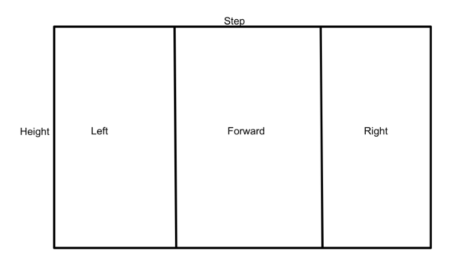

# ball Chaser

> This ROS package allows a robot to follow a white ball.

This package:
* Creates the node **drive_bot** with service **/ball_chaser/command_robot** that receives a **\Twist** message and publishes velocities to **/cmd_vel**
* Creates the node **process_image** that subscribes to **/camera/rgb/image_raw**. Depending on the position of a white ball, triggers the service **/ball_chaser/command_robot** and moves the robot left, right or forward (See image below). 

**Use this package with [my robot](https://github.com/lemontyc/my_robot) repository.**


## Requirements

* ROS Kinetic or up.
* Gazebo 7.16.0 or up.


## Running

1. Build the package:
```sh
$ catkin_make
```
2. Source your environment:
```sh
$ source devel/setup.bash
```
3. Run launch file:
```sh
roslaunch ball_chaser ball_chaser.launch
```
## How process_image works

De node locates the white ball in the image received as follows:

Where located, it will send according velocities.


## Meta

* **Luis M.**           - [GitHub](https://github.com/lemontyc)

Distributed under the MIT License. See ``LICENSE`` for more information.

This project was developed for the **Robotics software Engineer Nanodegree Program** course at **Udacity**.